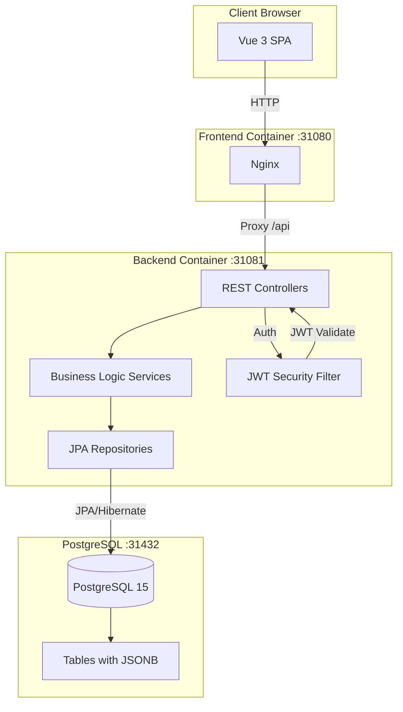
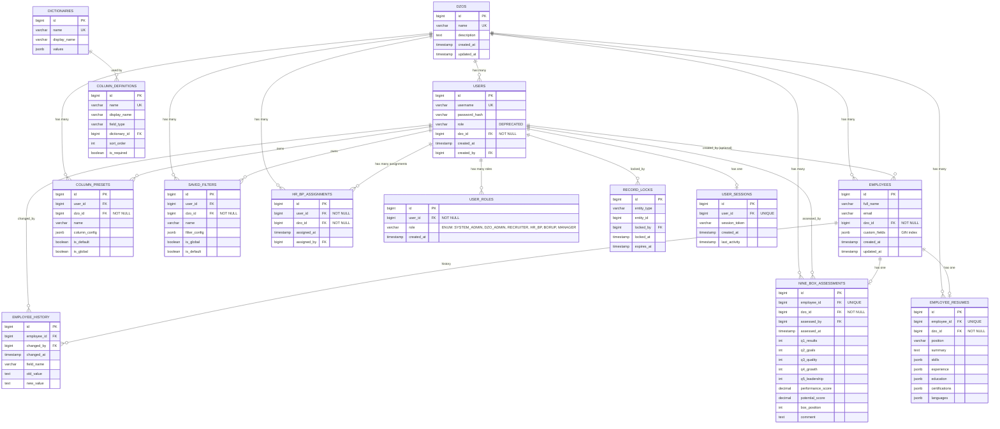
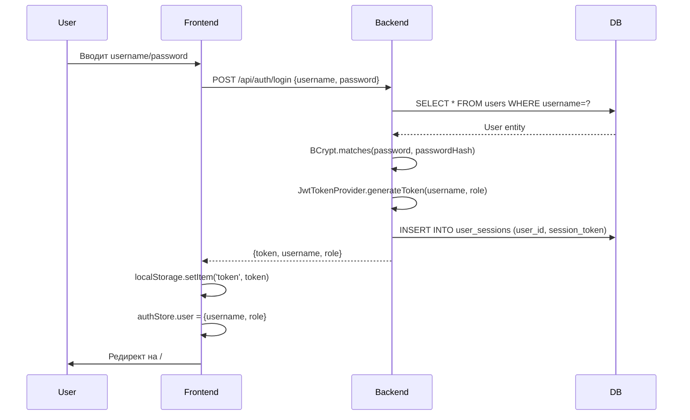
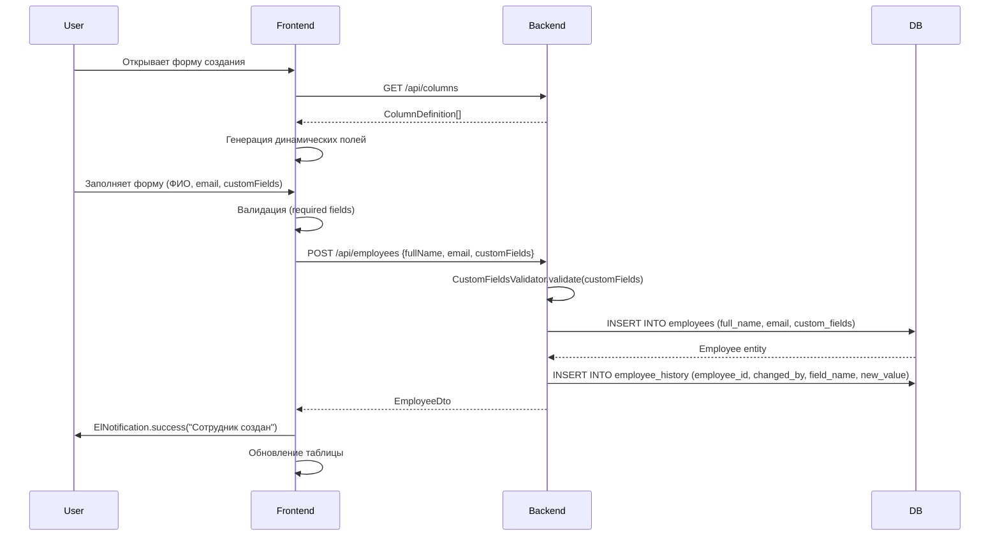
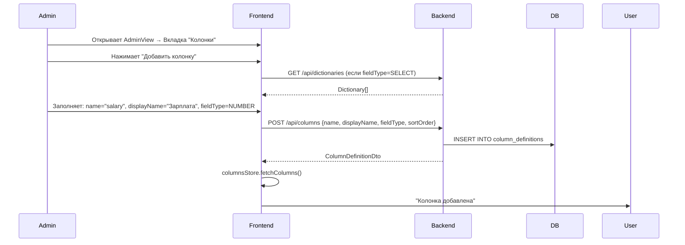
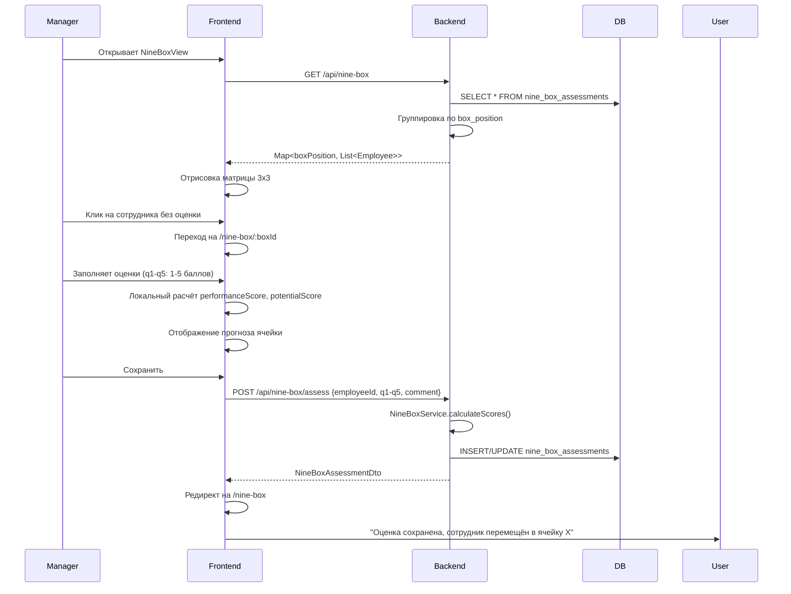
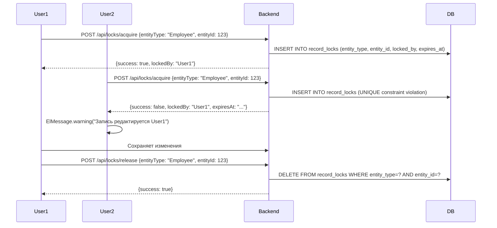

# Birzha — Resource Management Tool

**Карта архитектуры проекта**
**Дата создания:** 2026-01-21
**Последнее обновление:** 2026-01-21
**Версия:** 1.3.0

---

## 1. Общее описание системы

### Назначение проекта

Birzha — внутренняя система для управления ресурсами и отслеживания доступности сотрудников компании. Система позволяет:
- Централизованно хранить информацию о сотрудниках
- **Мультитенантность**: Поддержка нескольких ДЗО (дочерних зависимых обществ) с изоляцией данных
- **Расширенная система ролей**: 6 ролей (SYSTEM_ADMIN, DZO_ADMIN, RECRUITER, HR_BP, BORUP, MANAGER), множественные роли на пользователя
- Отслеживать их доступность и аллокацию на проекты
- Управлять динамическими полями через кастомизируемые колонки
- Оценивать сотрудников по модели 9-Box (Performance vs Potential)
- Генерировать и экспортировать проектные резюме
- Экспортировать данные в Excel
- Вести историю всех изменений (аудит)

### Основные Use Cases

1. **HR/Менеджер просматривает список сотрудников**
   - Фильтрация по любым полям (включая кастомные)
   - Сортировка по колонкам
   - Экспорт в Excel

2. **HR добавляет/редактирует сотрудника**
   - Заполнение базовых полей (ФИО, email)
   - Заполнение динамических полей (уровень, стек, проект и т.д.)
   - Автоматическое сохранение истории изменений

3. **Админ настраивает систему**
   - Добавляет/удаляет колонки
   - Управляет справочниками (dictionaries)
   - Создаёт пользователей с ролями ADMIN/USER

4. **Менеджер оценивает сотрудника (9-Box)**
   - Проводит оценку по 5 вопросам (1-5 баллов)
   - Система автоматически рассчитывает Performance/Potential
   - Размещает сотрудника в одну из 9 ячеек матрицы

5. **Рекрутер формирует проектное резюме**
   - Заполняет навыки, опыт, образование
   - Генерирует PDF с кириллицей (DejaVuSans font)

### Роли пользователей

**Новая система ролей (Phase 2):** Множественные роли на пользователя

| Роль  | Enum | Возможности |
|-------|------|-------------|
| **Администратор системы** | SYSTEM_ADMIN | Полный доступ: управление ДЗО, пользователями, всеми настройками |
| **Администратор ДЗО** | DZO_ADMIN | Управление сотрудниками и настройками в рамках своего ДЗО |
| **Рекрутер** | RECRUITER | Работа с резюме, добавление/редактирование сотрудников |
| **HR BP** | HR_BP | Доступ к назначенным ДЗО, оценки 9-Box |
| **БОРУП** | BORUP | Доступ к аналитике и отчётам |
| **Руководитель** | MANAGER | Просмотр сотрудников, оценки 9-Box |

**Особенности:**
- Пользователь может иметь несколько ролей одновременно
- Роли хранятся в отдельной таблице `user_roles` (many-to-many)
- HR BP может быть назначен на несколько ДЗО через таблицу `hr_bp_assignments`
- JWT токен содержит массив ролей для проверки прав доступа

### Технологический стек

#### Backend
- **Java 17**
- **Spring Boot 3.2.5**
  - Spring Web
  - Spring Data JPA
  - Spring Security
  - Spring Validation
  - Spring Actuator
- **PostgreSQL 15+** (JSONB для динамических полей)
- **Flyway 10.10.0** (миграции БД)
- **JWT Authentication** (jjwt 0.12.3)
- **Hypersistence Utils 3.7.3** (для работы с JSONB)
- **Apache POI 5.2.5** (экспорт в Excel)
- **OpenPDF 1.3.35** (генерация PDF резюме)
- **Lombok** (кодогенерация)
- **BCrypt** (хеширование паролей)

#### Frontend
- **Vue 3.5.24** (Composition API)
- **Pinia 3.0.4** (state management)
- **Vue Router 4.6.4** (маршрутизация)
- **Element Plus 2.13.1** (UI компоненты)
- **Axios 1.13.2** (HTTP клиент)
- **Vuedraggable 4.1.0** (drag & drop для сортировки)
- **Vite 7.2.4** (сборщик)

#### Infrastructure
- **Docker** + **docker-compose**
- **Nginx** (для раздачи frontend)
- **PostgreSQL 15-alpine** (контейнер БД)

---

## 2. Архитектура высокого уровня

### Диаграмма компонентов



### Сетевая конфигурация

| Сервис | Внутренний порт | Внешний порт | Описание |
|--------|-----------------|--------------|----------|
| Frontend | 80 | 31080 | Nginx с Vue.js SPA |
| Backend | 8080 | 31081 | Spring Boot REST API |
| PostgreSQL | 5432 | 31432 | База данных |

**Docker сеть:** `resource-network` (bridge)

### Взаимодействие компонентов

1. **Пользователь → Frontend (Vue SPA)**
   - Рендеринг интерфейса
   - Клиентская валидация
   - State management (Pinia)

2. **Frontend → Backend (REST API)**
   - Axios client с interceptors
   - JWT токен в Authorization header
   - JSON запросы/ответы

3. **Backend → Database**
   - JPA/Hibernate ORM
   - JSONB для динамических полей
   - Flyway для миграций

---

## 3. Backend архитектура

### Структура пакетов

```
com.company.resourcemanager/
├── ResourceManagerApplication.java    # Entry point
├── config/                             # Конфигурация
│   ├── SecurityConfig.java            # Spring Security + CORS
│   ├── JwtTokenProvider.java          # Генерация/валидация JWT
│   └── JwtAuthenticationFilter.java   # Фильтр для JWT
├── controller/                         # REST контроллеры
│   ├── AuthController.java            # Авторизация
│   ├── DzoController.java             # Управление ДЗО (ADMIN)
│   ├── RoleController.java            # Управление ролями (SYSTEM_ADMIN)
│   ├── EmployeeController.java        # CRUD сотрудников
│   ├── ColumnController.java          # Управление колонками (ADMIN)
│   ├── ColumnPresetController.java    # Пресеты колонок
│   ├── DictionaryController.java      # Справочники (ADMIN)
│   ├── UserController.java            # Пользователи (ADMIN)
│   ├── SavedFilterController.java     # Сохранённые фильтры
│   ├── LockController.java            # Блокировки записей
│   ├── NineBoxController.java         # 9-Box оценки
│   └── ResumeController.java          # Резюме сотрудников
├── service/                            # Бизнес-логика
│   ├── AuthService.java               # Логин/логаут/токены (обновлён для ролей)
│   ├── CurrentUserService.java        # Получение пользователя + проверка ролей и доступа к ДЗО
│   ├── RoleService.java               # Управление ролями и назначениями HR BP
│   ├── DzoService.java                # CRUD ДЗО
│   ├── EmployeeService.java           # CRUD + фильтрация + история + фильтр по ДЗО
│   ├── ExcelExportService.java        # Экспорт в Excel
│   ├── ColumnPresetService.java       # Пресеты колонок
│   ├── SavedFilterService.java        # Сохранённые фильтры
│   ├── LockService.java               # Блокировки при редактировании
│   ├── NineBoxService.java            # Расчёт 9-Box
│   ├── ResumePdfService.java          # Генерация PDF резюме
│   ├── ResumeService.java             # CRUD резюме
│   ├── UserService.java               # CRUD пользователей (обновлён для ролей)
│   ├── CustomFieldsValidator.java     # Валидация JSONB полей
│   └── FullNameValidator.java         # Валидация ФИО
├── repository/                         # JPA репозитории
│   ├── DzoRepository.java
│   ├── UserRepository.java
│   ├── UserRoleRepository.java         # Роли пользователей
│   ├── HrBpAssignmentRepository.java   # Назначения HR BP на ДЗО
│   ├── EmployeeRepository.java
│   ├── EmployeeHistoryRepository.java
│   ├── ColumnDefinitionRepository.java
│   ├── DictionaryRepository.java
│   ├── ColumnPresetRepository.java
│   ├── SavedFilterRepository.java
│   ├── RecordLockRepository.java
│   ├── UserSessionRepository.java
│   ├── NineBoxAssessmentRepository.java
│   └── EmployeeResumeRepository.java
├── entity/                             # JPA сущности
│   ├── Dzo.java
│   ├── User.java
│   ├── Role.java                       # Enum с 6 ролями
│   ├── UserRole.java                   # Связь User-Role
│   ├── HrBpAssignment.java             # Назначения HR BP
│   ├── Employee.java
│   ├── EmployeeHistory.java
│   ├── ColumnDefinition.java
│   ├── Dictionary.java
│   ├── ColumnPreset.java
│   ├── SavedFilter.java
│   ├── RecordLock.java
│   ├── UserSession.java
│   ├── NineBoxAssessment.java
│   └── EmployeeResume.java
├── dto/                                # Data Transfer Objects
│   ├── LoginRequest.java
│   ├── LoginResponse.java             # Обновлён: добавлены roles, dzoId
│   ├── DzoDto.java
│   ├── CreateDzoRequest.java
│   ├── UpdateDzoRequest.java
│   ├── UserDto.java                   # Обновлён: добавлены roles, dzoId
│   ├── CreateUserRequest.java         # Обновлён: roles вместо role
│   ├── UpdateUserRequest.java         # Обновлён: roles вместо role
│   ├── RoleDto.java                   # Новый: {name, displayName}
│   ├── AssignRoleRequest.java         # Новый: {userId, role}
│   ├── AssignHrBpRequest.java         # Новый: {userId, dzoId}
│   ├── EmployeeDto.java
│   ├── CreateEmployeeRequest.java
│   ├── UpdateEmployeeRequest.java
│   ├── EmployeeHistoryDto.java
│   ├── ColumnDefinitionDto.java
│   ├── CreateColumnRequest.java
│   └── ... (другие DTO)
└── exception/                          # Обработка ошибок
    ├── GlobalExceptionHandler.java
    ├── ResourceNotFoundException.java
    └── ... (другие исключения)
```

---

### Entities (Сущности БД)

#### 3.1. Dzo

**Назначение:** Дочерние зависимые общества (организации) для мультитенантности

**Поля:**
- `id` — BIGINT, PK
- `name` — VARCHAR(255), UNIQUE, NOT NULL
- `description` — TEXT
- `createdAt` — TIMESTAMP
- `updatedAt` — TIMESTAMP

**Связи:**
- `@OneToMany` → User (один ДЗО имеет много пользователей)
- `@OneToMany` → Employee (один ДЗО имеет много сотрудников)
- `@OneToMany` → ColumnPreset, SavedFilter, NineBoxAssessment, EmployeeResume

**Особенности:**
- Обеспечивает изоляцию данных между организациями
- Все запросы автоматически фильтруются по ДЗО текущего пользователя
- ADMIN может управлять ДЗО

#### 3.2. User

**Назначение:** Учётные записи пользователей системы

**Поля:**
- `id` — BIGINT, PK
- `username` — VARCHAR(50), UNIQUE, NOT NULL
- `passwordHash` — VARCHAR(255), BCrypt хеш
- `role` — VARCHAR(20), @Deprecated (старая роль ADMIN/USER)
- `dzoId` — FK → dzos(id), NOT NULL
- `createdAt` — TIMESTAMP
- `createdBy` — FK → users(id) (self-reference)

**Связи:**
- `@ManyToOne dzo` — принадлежность к ДЗО
- `@ManyToOne createdBy` — кто создал пользователя
- `@OneToMany userRoles` — роли пользователя (EAGER fetch)
- Используется в EmployeeHistory, RecordLock, UserSession, NineBoxAssessment

**Особенности:**
- Пароли хешируются BCrypt
- Новая система ролей через таблицу `user_roles` (many-to-many)
- Каждый пользователь привязан к одному ДЗО
- Helper методы: `getRoles()`, `hasRole(Role)`, `addRole(Role)`, `removeRole(Role)`

#### 3.2.1. UserRole

**Назначение:** Связь пользователей с ролями (many-to-many)

**Поля:**
- `id` — BIGINT, PK
- `userId` — FK → users(id) ON DELETE CASCADE
- `role` — ENUM (SYSTEM_ADMIN, DZO_ADMIN, RECRUITER, HR_BP, BORUP, MANAGER)
- `createdAt` — TIMESTAMP

**Индексы:**
- `idx_user_roles_user` на user_id
- `idx_user_roles_role` на role

**Уникальный ключ:** (user_id, role)

#### 3.2.2. HrBpAssignment

**Назначение:** Назначение HR BP на ДЗО

**Поля:**
- `id` — BIGINT, PK
- `userId` — FK → users(id) ON DELETE CASCADE
- `dzoId` — FK → dzos(id) ON DELETE CASCADE
- `assignedAt` — TIMESTAMP
- `assignedBy` — FK → users(id)

**Индексы:**
- `idx_hr_bp_assignments_user` на user_id
- `idx_hr_bp_assignments_dzo` на dzo_id

**Уникальный ключ:** (user_id, dzo_id)

**Особенности:**
- HR BP может быть назначен на несколько ДЗО
- Используется для фильтрации данных: HR BP видит только сотрудников назначенных ДЗО

#### 3.3. Employee

**Назначение:** Сотрудники компании

**Поля:**
- `id` — BIGINT, PK
- `fullName` — VARCHAR(255), NOT NULL
- `email` — VARCHAR(255)
- `dzoId` — FK → dzos(id), NOT NULL
- `customFields` — JSONB (динамические поля)
- `createdAt` — TIMESTAMP
- `updatedAt` — TIMESTAMP

**Индексы:**
- GIN index на `customFields` (для быстрого поиска по JSONB)
- B-tree index на `fullName`
- B-tree index на `dzoId`

**JSONB структура customFields:**
```json
{
  "level": "Senior",
  "stack": "Java, Spring",
  "project": "Project X",
  "availability_date": "2026-02-01",
  "location": "Remote",
  ...
}
```

**Связи:**
- `@ManyToOne dzo` — принадлежность к ДЗО
- `@OneToMany` → EmployeeHistory
- `@OneToOne` → NineBoxAssessment
- `@OneToOne` → EmployeeResume

**Особенности:**
- Использует Hypersistence Utils для JSONB
- Автоматическое обновление `updatedAt` через @PreUpdate
- Каждый сотрудник привязан к одному ДЗО
- Автоматическая фильтрация по ДЗО текущего пользователя

#### 3.3. EmployeeHistory

**Назначение:** Аудит всех изменений сотрудников

**Поля:**
- `id` — BIGINT, PK
- `employeeId` — FK → employees(id) ON DELETE CASCADE
- `changedBy` — FK → users(id)
- `changedAt` — TIMESTAMP
- `fieldName` — VARCHAR(100) (имя изменённого поля)
- `oldValue` — TEXT
- `newValue` — TEXT

**Индексы:**
- `idx_employee_history_employee` на `employee_id`
- `idx_employee_history_changed_at` на `changed_at`

**Особенности:**
- Записывается при каждом UPDATE/CREATE сотрудника
- Логируются как базовые поля (fullName, email), так и customFields

#### 3.4. ColumnDefinition

**Назначение:** Метаданные динамических колонок

**Поля:**
- `id` — BIGINT, PK
- `name` — VARCHAR(50), UNIQUE (техническое имя)
- `displayName` — VARCHAR(100) (отображаемое имя)
- `fieldType` — ENUM (TEXT, SELECT, DATE, NUMBER)
- `dictionaryId` — FK → dictionaries(id) (для SELECT)
- `sortOrder` — INT (порядок отображения)
- `isRequired` — BOOLEAN

**Связи:**
- `@ManyToOne dictionary` — справочник для SELECT типа

**Особенности:**
- Определяет структуру customFields в Employee
- Если fieldType=SELECT, должен быть привязан к Dictionary

#### 3.5. Dictionary

**Назначение:** Справочники значений для SELECT колонок

**Поля:**
- `id` — BIGINT, PK
- `name` — VARCHAR(50), UNIQUE
- `displayName` — VARCHAR(100)
- `values` — JSONB (массив строк)

**JSONB структура values:**
```json
["Junior", "Middle", "Senior", "Lead"]
```

**Особенности:**
- Используется для dropdown списков

#### 3.6. ColumnPreset

**Назначение:** Сохранённые настройки видимости колонок (борды)

**Поля:**
- `id` — BIGINT, PK
- `userId` — FK → users(id) ON DELETE CASCADE
- `dzoId` — FK → dzos(id), NOT NULL
- `name` — VARCHAR(100)
- `columnConfig` — JSONB (настройки колонок)
- `isDefault` — BOOLEAN
- `isGlobal` — BOOLEAN (доступен всем пользователям в ДЗО)
- `createdAt`, `updatedAt` — TIMESTAMP

**JSONB структура columnConfig:**
```json
[
  {"prop": "fullName", "visible": true},
  {"prop": "level", "visible": true},
  {"prop": "stack", "visible": false}
]
```

**Связи:**
- `@ManyToOne dzo` — принадлежность к ДЗО

**Уникальный ключ:** (user_id, name, dzo_id)

#### 3.7. SavedFilter

**Назначение:** Сохранённые фильтры для быстрого поиска

**Поля:**
- `id` — BIGINT, PK
- `userId` — FK → users(id) ON DELETE CASCADE
- `dzoId` — FK → dzos(id), NOT NULL
- `name` — VARCHAR(100)
- `filterConfig` — JSONB (параметры фильтра)
- `isGlobal` — BOOLEAN (доступен всем пользователям в ДЗО)
- `isDefault` — BOOLEAN
- `createdAt`, `updatedAt` — TIMESTAMP

**JSONB структура filterConfig:**
```json
{
  "search": "John",
  "customFields": {
    "level": "Senior",
    "project": "Project X"
  },
  "dateFilters": {
    "availability_date": "after:2026-02-01"
  }
}
```

**Связи:**
- `@ManyToOne dzo` — принадлежность к ДЗО

**Уникальный ключ:** (user_id, name, dzo_id)

#### 3.8. RecordLock

**Назначение:** Пессимистическая блокировка записей при редактировании

**Поля:**
- `id` — BIGINT, PK
- `entityType` — VARCHAR(50) (например, "Employee")
- `entityId` — BIGINT (ID записи)
- `lockedBy` — FK → users(id) ON DELETE CASCADE
- `lockedAt` — TIMESTAMP
- `expiresAt` — TIMESTAMP

**Уникальный ключ:** (entity_type, entity_id)

**Индексы:**
- `idx_record_locks_entity` на (entity_type, entity_id)
- `idx_record_locks_expires` на expires_at

**Особенности:**
- Автоматическая очистка истёкших блокировок
- Предотвращает одновременное редактирование

#### 3.9. UserSession

**Назначение:** Активные сессии пользователей

**Поля:**
- `id` — BIGINT, PK
- `userId` — FK → users(id) ON DELETE CASCADE, UNIQUE
- `sessionToken` — VARCHAR(255) (JWT токен)
- `createdAt` — TIMESTAMP
- `lastActivity` — TIMESTAMP

**Индексы:**
- `idx_user_sessions_token` на session_token
- `idx_user_sessions_user` на user_id

**Особенности:**
- Только одна активная сессия на пользователя (UNIQUE constraint)
- Обновляется `lastActivity` при каждом запросе

#### 3.10. NineBoxAssessment

**Назначение:** Оценки сотрудников по модели 9-Box

**Поля:**
- `id` — BIGINT, PK
- `employeeId` — FK → employees(id) ON DELETE CASCADE, UNIQUE
- `dzoId` — FK → dzos(id), NOT NULL
- `assessedBy` — FK → users(id)
- `assessedAt` — TIMESTAMP
- `q1Results` — INT (1-5) — Достижение результатов
- `q2Goals` — INT (1-5) — Выполнение целей
- `q3Quality` — INT (1-5) — Качество работы
- `q4Growth` — INT (1-5) — Потенциал роста
- `q5Leadership` — INT (1-5) — Лидерство
- `performanceScore` — DECIMAL(3,2) (рассчитывается)
- `potentialScore` — DECIMAL(3,2) (рассчитывается)
- `boxPosition` — INT (1-9) (позиция в матрице)
- `comment` — TEXT

**Связи:**
- `@ManyToOne dzo` — принадлежность к ДЗО

**Расчёт:**
```java
performanceScore = (q1Results + q2Goals + q3Quality) / 3.0
potentialScore = (q4Growth + q5Leadership) / 2.0

// Уровни: Low (<=2.3), Medium (2.4-3.6), High (>3.6)
perfLevel = getLevel(performanceScore)  // 0, 1, 2
potLevel = getLevel(potentialScore)

boxPosition = potLevel * 3 + perfLevel + 1  // 1-9
```

**9-Box матрица:**
```
High Pot    │  7  │  8  │  9  │
Med Pot     │  4  │  5  │  6  │
Low Pot     │  1  │  2  │  3  │
            └─────┴─────┴─────┘
             Low   Med   High
           (Performance)
```

**Индексы:**
- `idx_nine_box_employee` на employee_id
- `idx_nine_box_box_position` на box_position
- `idx_nine_box_assessed_at` на assessed_at

#### 3.11. EmployeeResume

**Назначение:** Проектные резюме сотрудников

**Поля:**
- `id` — BIGINT, PK
- `employeeId` — FK → employees(id) ON DELETE CASCADE, UNIQUE
- `dzoId` — FK → dzos(id), NOT NULL
- `position` — VARCHAR(255) (должность для резюме)
- `summary` — TEXT (краткое описание)
- `skills` — JSONB (навыки)
- `experience` — JSONB (опыт работы)
- `education` — JSONB (образование)
- `certifications` — JSONB (сертификаты)
- `languages` — JSONB (языки)
- `createdAt`, `updatedAt` — TIMESTAMP

**Связи:**
- `@ManyToOne dzo` — принадлежность к ДЗО

**JSONB структуры:**

```json
// skills
[
  {"name": "Java", "level": "Expert", "years": 8},
  {"name": "Spring Boot", "level": "Advanced", "years": 5}
]

// experience
[
  {
    "company": "Company Ltd",
    "position": "Senior Java Developer",
    "startDate": "2020-01",
    "endDate": "2023-12",
    "description": "Led development of...",
    "projects": ["Project A", "Project B"]
  }
]

// education
[
  {
    "institution": "MIT",
    "degree": "Bachelor",
    "field": "Computer Science",
    "year": 2015
  }
]

// certifications
[
  {"name": "AWS Certified", "issuer": "Amazon", "year": 2022}
]

// languages
[
  {"language": "English", "level": "Fluent"},
  {"language": "Russian", "level": "Native"}
]
```

---

### REST API Endpoints

#### Auth

| Метод | URL | Описание | Роли | Контроллер |
|-------|-----|----------|------|------------|
| POST | /api/auth/login | Авторизация (username/password) → JWT | PUBLIC | AuthController |
| GET | /api/auth/me | Получить текущего пользователя | AUTH | AuthController |
| POST | /api/auth/logout | Выход из системы | AUTH | AuthController |

#### DZO (ADMIN only)

| Метод | URL | Описание | Роли | Контроллер |
|-------|-----|----------|------|------------|
| GET | /api/dzos | Список всех ДЗО | ADMIN | DzoController |
| GET | /api/dzos/{id} | Один ДЗО | ADMIN | DzoController |
| POST | /api/dzos | Создание ДЗО | ADMIN | DzoController |
| PUT | /api/dzos/{id} | Обновление | ADMIN | DzoController |
| DELETE | /api/dzos/{id} | Удаление | ADMIN | DzoController |

#### Employees

| Метод | URL | Описание | Роли | Контроллер |
|-------|-----|----------|------|------------|
| GET | /api/employees | Список с пагинацией и фильтрацией | AUTH | EmployeeController |
| GET | /api/employees/{id} | Один сотрудник | AUTH | EmployeeController |
| POST | /api/employees | Создание сотрудника | AUTH | EmployeeController |
| PUT | /api/employees/{id} | Обновление | AUTH | EmployeeController |
| DELETE | /api/employees/{id} | Удаление | AUTH | EmployeeController |
| GET | /api/employees/{id}/history | История изменений | AUTH | EmployeeController |
| GET | /api/employees/history/recent | Последние изменения (limit) | AUTH | EmployeeController |
| GET | /api/employees/export | Экспорт в Excel (XLSX) | AUTH | EmployeeController |

**Параметры фильтрации GET /api/employees:**
- `search` — поиск по ФИО и email
- `fullName` — фильтр по ФИО
- `email` — фильтр по email
- `customFields[fieldName]` — фильтр по кастомным полям (поддерживает множественные значения через запятую)
- `dateFilters[fieldName]` — фильтры по датам (формат: `before:YYYY-MM-DD`, `after:YYYY-MM-DD`, `equals:YYYY-MM-DD`)
- `page`, `size`, `sort` — пагинация и сортировка

#### Columns (ADMIN only)

| Метод | URL | Описание | Роли | Контроллер |
|-------|-----|----------|------|------------|
| GET | /api/columns | Список всех колонок | AUTH | ColumnController |
| GET | /api/columns/{id} | Одна колонка | AUTH | ColumnController |
| POST | /api/columns | Создание колонки | ADMIN | ColumnController |
| PUT | /api/columns/{id} | Обновление | ADMIN | ColumnController |
| DELETE | /api/columns/{id} | Удаление | ADMIN | ColumnController |
| PUT | /api/columns/reorder | Изменение порядка (массив ID) | ADMIN | ColumnController |

#### Dictionaries (ADMIN only)

| Метод | URL | Описание | Роли | Контроллер |
|-------|-----|----------|------|------------|
| GET | /api/dictionaries | Список справочников | AUTH | DictionaryController |
| GET | /api/dictionaries/{id} | Один справочник | AUTH | DictionaryController |
| POST | /api/dictionaries | Создание | ADMIN | DictionaryController |
| PUT | /api/dictionaries/{id} | Обновление | ADMIN | DictionaryController |
| DELETE | /api/dictionaries/{id} | Удаление | ADMIN | DictionaryController |

#### Users (SYSTEM_ADMIN only)

| Метод | URL | Описание | Роли | Контроллер |
|-------|-----|----------|------|------------|
| GET | /api/users | Список пользователей | SYSTEM_ADMIN | UserController |
| POST | /api/users | Создание пользователя (с ролями и ДЗО) | SYSTEM_ADMIN | UserController |
| PUT | /api/users/{id} | Обновление (роли, ДЗО, пароль) | SYSTEM_ADMIN | UserController |
| DELETE | /api/users/{id} | Деактивация | SYSTEM_ADMIN | UserController |

#### Roles (SYSTEM_ADMIN only)

| Метод | URL | Описание | Роли | Контроллер |
|-------|-----|----------|------|------------|
| GET | /api/roles | Список всех ролей (enum) | AUTH | RoleController |
| GET | /api/roles/user/{userId} | Роли пользователя | SYSTEM_ADMIN | RoleController |
| POST | /api/roles/assign | Назначить роль {userId, role} | SYSTEM_ADMIN | RoleController |
| POST | /api/roles/remove | Удалить роль {userId, role} | SYSTEM_ADMIN | RoleController |
| GET | /api/roles/role/{role}/users | Пользователи с ролью | SYSTEM_ADMIN | RoleController |
| POST | /api/roles/hr-bp/assign | Назначить HR BP на ДЗО {userId, dzoId} | SYSTEM_ADMIN | RoleController |
| POST | /api/roles/hr-bp/remove | Удалить назначение HR BP {userId, dzoId} | SYSTEM_ADMIN | RoleController |
| GET | /api/roles/hr-bp/{userId}/dzos | Список ДЗО для HR BP | SYSTEM_ADMIN, HR_BP | RoleController |
| GET | /api/roles/dzo/{dzoId}/hr-bps | Список HR BP для ДЗО | SYSTEM_ADMIN, DZO_ADMIN, HR_BP | RoleController |

#### Column Presets

| Метод | URL | Описание | Роли | Контроллер |
|-------|-----|----------|------|------------|
| GET | /api/column-presets | Список пресетов пользователя | AUTH | ColumnPresetController |
| GET | /api/column-presets/{id} | Один пресет | AUTH | ColumnPresetController |
| POST | /api/column-presets | Создание пресета | AUTH | ColumnPresetController |
| PUT | /api/column-presets/{id} | Обновление | AUTH | ColumnPresetController |
| DELETE | /api/column-presets/{id} | Удаление | AUTH | ColumnPresetController |
| PUT | /api/column-presets/{id}/default | Сделать дефолтным | AUTH | ColumnPresetController |

#### Saved Filters

| Метод | URL | Описание | Роли | Контроллер |
|-------|-----|----------|------|------------|
| GET | /api/saved-filters | Список фильтров пользователя | AUTH | SavedFilterController |
| POST | /api/saved-filters | Создание фильтра | AUTH | SavedFilterController |
| PUT | /api/saved-filters/{id} | Обновление | AUTH | SavedFilterController |
| DELETE | /api/saved-filters/{id} | Удаление | AUTH | SavedFilterController |
| PUT | /api/saved-filters/{id}/default | Сделать дефолтным | AUTH | SavedFilterController |

#### Locks

| Метод | URL | Описание | Роли | Контроллер |
|-------|-----|----------|------|------------|
| POST | /api/locks/acquire | Захват блокировки (entityType, entityId) | AUTH | LockController |
| POST | /api/locks/release | Освобождение блокировки | AUTH | LockController |
| GET | /api/locks/check | Проверка блокировки | AUTH | LockController |

#### Nine Box

| Метод | URL | Описание | Роли | Контроллер |
|-------|-----|----------|------|------------|
| GET | /api/nine-box | Матрица 9-Box (группировка по ячейкам) | AUTH | NineBoxController |
| GET | /api/nine-box/employee/{employeeId} | Оценка сотрудника | AUTH | NineBoxController |
| POST | /api/nine-box/assess | Создание/обновление оценки | AUTH | NineBoxController |

#### Resumes

| Метод | URL | Описание | Роли | Контроллер |
|-------|-----|----------|------|------------|
| GET | /api/resumes | Список всех резюме | AUTH | ResumeController |
| GET | /api/resumes/employee/{employeeId} | Резюме сотрудника | AUTH | ResumeController |
| POST | /api/resumes | Создание резюме | AUTH | ResumeController |
| PUT | /api/resumes/{id} | Обновление | AUTH | ResumeController |
| DELETE | /api/resumes/{id} | Удаление | AUTH | ResumeController |
| GET | /api/resumes/{id}/pdf | Генерация PDF (DejaVuSans для кириллицы) | AUTH | ResumeController |

---

### Сервисный слой

#### 3.12. CurrentUserService

**Ответственность:**
- Получение текущего аутентифицированного пользователя
- Определение ДЗО текущего пользователя
- Проверка ролей текущего пользователя
- Проверка доступа к ДЗО (для HR BP проверяются назначения)
- Используется всеми сервисами для автоматической фильтрации по ДЗО

**Ключевая логика:**

```java
public User getCurrentUser() {
    Authentication auth = SecurityContextHolder.getContext().getAuthentication();
    String username = auth.getName();
    return userRepository.findByUsername(username)
        .orElseThrow(() -> new ResourceNotFoundException("User not found"));
}

public Long getCurrentDzoId() {
    User user = getCurrentUser();
    return user.getDzo() != null ? user.getDzo().getId() : null;
}

public Set<Role> getCurrentUserRoles() {
    return getCurrentUser().getRoles();
}

public boolean hasRole(Role role) {
    return getCurrentUser().hasRole(role);
}

public boolean hasAnyRole(Role... roles) {
    Set<Role> userRoles = getCurrentUserRoles();
    for (Role role : roles) {
        if (userRoles.contains(role)) {
            return true;
        }
    }
    return false;
}

public boolean isSystemAdmin() {
    return hasRole(Role.SYSTEM_ADMIN);
}

public boolean isDzoAdmin() {
    return hasRole(Role.DZO_ADMIN);
}

public boolean isRecruiter() {
    return hasRole(Role.RECRUITER);
}

public boolean isHrBp() {
    return hasRole(Role.HR_BP);
}

public boolean isBorup() {
    return hasRole(Role.BORUP);
}

public boolean isManager() {
    return hasRole(Role.MANAGER);
}

public List<Dzo> getAssignedDzos() {
    if (!isHrBp()) {
        return List.of();
    }
    return hrBpAssignmentRepository.findDzosByUserId(getCurrentUser().getId());
}

public boolean hasAccessToDzo(Long dzoId) {
    if (isSystemAdmin()) {
        return true;
    }
    if (isDzoAdmin() && getCurrentDzoId() != null && getCurrentDzoId().equals(dzoId)) {
        return true;
    }
    if (isHrBp()) {
        return getAssignedDzos().stream()
                .anyMatch(dzo -> dzo.getId().equals(dzoId));
    }
    return false;
}
```

#### 3.12.1. RoleService

**Ответственность:**
- Управление ролями пользователей (назначение/удаление)
- Управление назначениями HR BP на ДЗО
- Получение списка пользователей по роли
- Получение ДЗО для HR BP

**Ключевые методы:**

```java
@Transactional
public void assignRole(Long userId, Role role) {
    User user = userRepository.findById(userId)
            .orElseThrow(() -> new RuntimeException("User not found"));

    if (!userRoleRepository.existsByUserIdAndRole(userId, role)) {
        UserRole userRole = new UserRole(user, role);
        userRoleRepository.save(userRole);
    }
}

@Transactional
public void removeRole(Long userId, Role role) {
    userRoleRepository.deleteByUserIdAndRole(userId, role);
}

@Transactional(readOnly = true)
public Set<Role> getUserRoles(Long userId) {
    User user = userRepository.findById(userId)
            .orElseThrow(() -> new RuntimeException("User not found"));
    return user.getRoles();
}

@Transactional
public void assignHrBpToDzo(Long userId, Long dzoId, Long assignedByUserId) {
    User user = userRepository.findById(userId).orElseThrow();
    Dzo dzo = dzoRepository.findById(dzoId).orElseThrow();
    User assignedBy = userRepository.findById(assignedByUserId).orElseThrow();

    if (!hrBpAssignmentRepository.existsByUserIdAndDzoId(userId, dzoId)) {
        HrBpAssignment assignment = new HrBpAssignment(user, dzo, assignedBy);
        hrBpAssignmentRepository.save(assignment);
    }
}

@Transactional
public void removeHrBpFromDzo(Long userId, Long dzoId) {
    hrBpAssignmentRepository.deleteByUserIdAndDzoId(userId, dzoId);
}

@Transactional(readOnly = true)
public List<Dzo> getDzosForHrBp(Long userId) {
    return hrBpAssignmentRepository.findDzosByUserId(userId);
}

@Transactional(readOnly = true)
public List<User> getHrBpsForDzo(Long dzoId) {
    return hrBpAssignmentRepository.findUsersByDzoId(dzoId);
}
```

#### 3.13. DzoService

**Ответственность:**
- CRUD операции для ДЗО
- Доступен только ADMIN
- Валидация уникальности имени

**Особенности:**
- При удалении ДЗО каскадно удаляются все связанные данные (пользователи, сотрудники, оценки и т.д.)
- Проверка на наличие пользователей перед удалением

#### 3.14. EmployeeService

**Ответственность:**
- CRUD операции для сотрудников
- Сложная фильтрация (по customFields через JSONB запросы)
- Автоматическая фильтрация по ДЗО текущего пользователя
- Запись истории изменений
- Валидация полей через CustomFieldsValidator

**Ключевая логика:**

```java
// Фильтрация по ДЗО и JSONB (JPA Criteria API)
public Page<Employee> getEmployees(filters, pageable) {
    Dzo currentDzo = currentUserService.getCurrentDzo();

    Specification<Employee> spec = (root, query, cb) -> {
        List<Predicate> predicates = new ArrayList<>();

        // Автоматическая фильтрация по ДЗО
        predicates.add(cb.equal(root.get("dzo"), currentDzo));

        // customFields[level] = "Senior"
        if (filters.containsKey("level")) {
            predicates.add(cb.equal(
                cb.function("jsonb_extract_path_text", String.class,
                    root.get("customFields"), cb.literal("level")),
                filters.get("level")
            ));
        }

        return cb.and(predicates.toArray(new Predicate[0]));
    };

    return employeeRepository.findAll(spec, pageable);
}

// История изменений
private void recordHistory(Employee employee, Map<String, Object> oldFields, Map<String, Object> newFields) {
    for (String field : newFields.keySet()) {
        if (!Objects.equals(oldFields.get(field), newFields.get(field))) {
            employeeHistoryRepository.save(
                EmployeeHistory.builder()
                    .employee(employee)
                    .changedBy(currentUserService.getCurrentUser())
                    .fieldName(field)
                    .oldValue(oldFields.get(field))
                    .newValue(newFields.get(field))
                    .build()
            );
        }
    }
}
```

#### 3.13. ExcelExportService

**Ответственность:**
- Экспорт сотрудников в Excel (Apache POI)
- Учёт текущих фильтров (можно экспортировать только отфильтрованных)
- Динамические колонки

**Особенности:**
- Создаёт .xlsx с заголовками из ColumnDefinition
- Данные из customFields распаковываются в колонки

#### 3.14. NineBoxService

**Ответственность:**
- Создание/обновление оценок
- Автоматический расчёт performanceScore, potentialScore, boxPosition
- Группировка сотрудников по ячейкам матрицы

**Ключевая логика:**

```java
public Map<Integer, List<EmployeeDto>> getMatrixData() {
    Map<Integer, List<EmployeeDto>> matrix = new HashMap<>();
    for (int i = 1; i <= 9; i++) {
        matrix.put(i, new ArrayList<>());
    }

    List<NineBoxAssessment> assessments = assessmentRepository.findAll();
    for (NineBoxAssessment assessment : assessments) {
        EmployeeDto dto = toDto(assessment.getEmployee(), assessment);
        matrix.get(assessment.getBoxPosition()).add(dto);
    }

    return matrix;
}
```

#### 3.15. ResumePdfService

**Ответственность:**
- Генерация PDF резюме с использованием OpenPDF
- Поддержка кириллицы через DejaVuSans font (IDENTITY_H encoding)

**Особенности:**
- Встроенный шрифт DejaVuSans для корректного отображения русского текста
- Структурированная вёрстка (секции: Skills, Experience, Education, etc.)

#### 3.16. LockService

**Ответственность:**
- Захват/освобождение блокировок
- Автоматическая очистка истёкших блокировок
- TTL блокировки: 5 минут (по умолчанию)

**Особенности:**
- Предотвращает race condition через UNIQUE constraint (entity_type, entity_id)

#### 3.17. CustomFieldsValidator

**Ответственность:**
- Валидация значений customFields против ColumnDefinition
- Проверка обязательных полей (isRequired)
- Проверка типов (TEXT, SELECT, DATE, NUMBER)
- Проверка значений SELECT против Dictionary

---

### Безопасность

#### JWT Authentication

**Flow:**

1. **Login:**
   ```
   POST /api/auth/login {username, password}
   → BCrypt.matches(password, user.passwordHash)
   → JwtTokenProvider.generateToken(username, user.getRoles())
   → Response: {token, username, roles: ["SYSTEM_ADMIN"], dzoId: 1, role: "SYSTEM_ADMIN"}
   ```

   **LoginResponse структура:**
   ```json
   {
     "token": "eyJhbGciOi...",
     "username": "admin",
     "roles": ["SYSTEM_ADMIN"],
     "dzoId": 1,
     "role": "SYSTEM_ADMIN"  // deprecated, для обратной совместимости
   }
   ```

2. **Request с токеном:**
   ```
   GET /api/employees
   Header: Authorization: Bearer <JWT>
   → JwtAuthenticationFilter извлекает токен
   → JwtTokenProvider.validateToken(token)
   → JwtTokenProvider.getUsernameFromToken(token)
   → Spring Security устанавливает Authentication
   ```

3. **Logout:**
   ```
   POST /api/auth/logout
   → Удаление записи из user_sessions
   → Frontend очищает localStorage
   ```

**JWT структура (новая система ролей):**
```json
{
  "sub": "admin",
  "roles": ["SYSTEM_ADMIN"],
  "iat": 1737470000,
  "exp": 1737556400
}
```

**JWT структура (обратная совместимость):**
```json
{
  "sub": "admin",
  "role": "ADMIN",
  "roles": ["SYSTEM_ADMIN"],
  "iat": 1737470000,
  "exp": 1737556400
}
```

**Особенности:**
- JWT токен содержит массив `roles` с enum именами ролей
- Для обратной совместимости сохранено поле `role` (deprecated)
- Старые роли ADMIN и USER автоматически конвертируются в SYSTEM_ADMIN и MANAGER
- `JwtTokenProvider.getRolesFromToken()` извлекает Set<Role> из токена

**Конфигурация Security:**

```java
@Configuration
@EnableMethodSecurity
public class SecurityConfig {

    @Bean
    public SecurityFilterChain filterChain(HttpSecurity http) {
        http
            .csrf(disable)
            .cors(enable)
            .sessionManagement(STATELESS)
            .authorizeHttpRequests(auth -> auth
                .requestMatchers("/api/auth/login").permitAll()
                .requestMatchers("/actuator/health").permitAll()
                .anyRequest().authenticated()
            )
            .addFilterBefore(jwtAuthenticationFilter, UsernamePasswordAuthenticationFilter.class);
    }

    @Bean
    public PasswordEncoder passwordEncoder() {
        return new BCryptPasswordEncoder();
    }
}
```

**Ролевая модель:**

- Методы контроллеров с `@PreAuthorize("hasRole('ADMIN')")` доступны только ADMIN
- Роль проверяется из JWT claims
- Spring Security автоматически добавляет префикс "ROLE_" к ролям

---

## 4. Frontend архитектура

### Структура проекта

```
frontend/
├── public/                  # Статические файлы
├── src/
│   ├── main.js             # Entry point
│   ├── App.vue             # Root компонент
│   ├── router/
│   │   └── index.js        # Vue Router конфигурация
│   ├── stores/             # Pinia stores
│   │   ├── auth.js         # Авторизация
│   │   ├── dzo.js          # ДЗО store
│   │   ├── columns.js      # Колонки и справочники
│   │   ├── notifications.js # Уведомления
│   │   └── theme.js        # Тема UI
│   ├── api/                # HTTP клиенты
│   │   ├── client.js       # Axios instance с interceptors
│   │   ├── auth.js
│   │   ├── dzos.js         # API ДЗО
│   │   ├── employees.js
│   │   ├── columns.js
│   │   ├── dictionaries.js
│   │   ├── users.js
│   │   ├── columnPresets.js
│   │   ├── savedFilters.js
│   │   ├── locks.js
│   │   ├── nineBox.js
│   │   └── resumes.js
│   ├── views/              # Страницы
│   │   ├── LoginView.vue
│   │   ├── EmployeesView.vue          # Основная таблица (82KB!)
│   │   ├── EmployeeDetailView.vue
│   │   ├── AdminView.vue              # Управление настройками
│   │   ├── AnalyticsView.vue          # Аналитика
│   │   ├── NineBoxView.vue            # Матрица 9-Box
│   │   ├── NineBoxDetailView.vue      # Оценка сотрудника
│   │   └── ResumesView.vue            # Резюме
│   ├── components/         # Переиспользуемые компоненты
│   │   └── ... (специфичные UI компоненты)
│   └── utils/              # Утилиты
├── vite.config.js          # Vite конфигурация
├── package.json
├── nginx.conf              # Nginx для production
└── Dockerfile
```

---

### Router (Маршрутизация)

**Маршруты:**

| Path | Name | Component | Meta | Описание |
|------|------|-----------|------|----------|
| /login | Login | LoginView.vue | guest: true | Страница входа |
| / | Employees | EmployeesView.vue | requiresAuth | Главная таблица |
| /employees/:id | EmployeeDetail | EmployeeDetailView.vue | requiresAuth | Детали сотрудника |
| /admin | Admin | AdminView.vue | requiresAuth, requiresAdmin | Админка |
| /analytics | Analytics | AnalyticsView.vue | requiresAuth | Аналитика |
| /nine-box | NineBox | NineBoxView.vue | requiresAuth | Матрица 9-Box |
| /nine-box/:boxId | NineBoxDetail | NineBoxDetailView.vue | requiresAuth | Детали ячейки |
| /resumes | Resumes | ResumesView.vue | requiresAuth | Резюме |

**Guards (Navigation Guards):**

```javascript
router.beforeEach(async (to, from, next) => {
  const authStore = useAuthStore()

  // Автозагрузка пользователя если есть токен
  if (authStore.token && !authStore.user) {
    await authStore.fetchCurrentUser()
  }

  // Проверка авторизации
  if (to.meta.requiresAuth && !authStore.isAuthenticated) {
    next('/login')
  }
  // Гостевой роут для авторизованных → редирект
  else if (to.meta.guest && authStore.isAuthenticated) {
    next('/')
  }
  // Проверка роли ADMIN
  else if (to.meta.requiresAdmin && !authStore.isAdmin) {
    next('/')
  }
  else {
    next()
  }
})
```

---

### State Management (Pinia)

#### 4.1. authStore

**Состояние:**
- `token` — JWT токен (хранится в localStorage)
- `user` — объект пользователя {username, role}

**Computed:**
- `isAuthenticated` — !!token
- `isAdmin` — user.role === 'ADMIN'

**Actions:**
- `login(username, password)` — авторизация
- `fetchCurrentUser()` — загрузка текущего пользователя
- `logout()` — выход

**Особенности:**
- Токен синхронизируется с localStorage
- При 401 автоматически вызывается logout через axios interceptor

#### 4.2. dzoStore

**Состояние:**
- `dzos` — массив всех ДЗО (доступно только ADMIN)
- `currentDzo` — текущий ДЗО пользователя
- `loading` — флаг загрузки

**Actions:**
- `fetchDzos()` — загрузка списка ДЗО (только ADMIN)
- `createDzo(data)` — создание нового ДЗО
- `updateDzo(id, data)` — обновление
- `deleteDzo(id)` — удаление

**Особенности:**
- Используется в админке для управления организациями
- currentDzo автоматически устанавливается при логине из user.dzo

#### 4.3. columnsStore

**Состояние:**
- `columns` — массив ColumnDefinition
- `dictionaries` — Map<dictionaryId, Dictionary>
- `loading` — флаг загрузки

**Actions:**
- `fetchColumns()` — загрузка колонок и связанных справочников
- `getDictionaryValues(dictionaryId)` — получить значения справочника

**Особенности:**
- Кеширует справочники для минимизации запросов
- Сортирует колонки по sortOrder

#### 4.4. notificationsStore

**Ответственность:**
- Отображение toast-уведомлений (Element Plus ElNotification)
- success, error, warning, info

#### 4.5. themeStore

**Ответственность:**
- Переключение светлой/тёмной темы

---

### Views (Экраны)

#### 4.6. EmployeesView.vue (82KB!)

**Назначение:** Основная таблица со всеми сотрудниками

**Ключевые функции:**
- **Динамическая таблица** (el-table) с колонками из ColumnDefinition
- **Фильтрация:**
  - Глобальный поиск
  - Фильтры по кастомным полям (SELECT, DATE, TEXT)
  - Сохранение/загрузка фильтров (SavedFilter)
- **Сортировка** (server-side через sort parameter)
- **Пагинация** (el-pagination)
- **CRUD:**
  - Создание/редактирование через модальное окно (el-dialog)
  - Удаление с подтверждением
- **Экспорт в Excel** (скачивание .xlsx)
- **Настройка колонок:**
  - Показать/скрыть колонки
  - Сохранение пресетов (ColumnPreset)
- **История изменений** (drawer с таймлайном)

**Компоненты:**
- `<el-table>` — таблица
- `<el-dialog>` — модалка создания/редактирования
- `<el-drawer>` — боковая панель истории
- `<el-form>` — форма с динамическими полями (генерируются из ColumnDefinition)

**Сложные элементы:**
- **Динамические поля формы:**
  ```vue
  <el-form-item v-for="col in columns" :key="col.name">
    <el-input v-if="col.fieldType === 'TEXT'" />
    <el-select v-if="col.fieldType === 'SELECT'">
      <el-option v-for="val in getDictionaryValues(col.dictionaryId)" />
    </el-select>
    <el-date-picker v-if="col.fieldType === 'DATE'" />
    <el-input-number v-if="col.fieldType === 'NUMBER'" />
  </el-form-item>
  ```

- **JSONB фильтрация:**
  ```javascript
  // Frontend формирует параметры:
  params['customFields[level]'] = 'Senior,Lead'  // Множественный выбор
  params['dateFilters[availability_date]'] = 'after:2026-02-01'
  ```

#### 4.7. AdminView.vue

**Назначение:** Управление настройками системы

**Вкладки (el-tabs):**
1. **ДЗО** — CRUD Dzo (только для ADMIN)
2. **Колонки** — CRUD ColumnDefinition (с drag & drop для сортировки)
3. **Справочники** — CRUD Dictionary
4. **Пользователи** — CRUD Users

**CRUD операции:**
- Все через модальные окна
- Drag & Drop для изменения sortOrder колонок (vuedraggable)

#### 4.8. NineBoxView.vue

**Назначение:** Визуализация матрицы 9-Box

**UI:**
- 3x3 сетка ячеек (el-card)
- Каждая ячейка содержит список сотрудников с их фото/ФИО
- Клик на сотрудника → переход на NineBoxDetailView для оценки

**Логика:**
- Группировка сотрудников по boxPosition (1-9)
- Цветовое кодирование ячеек (красный → жёлтый → зелёный)

#### 4.9. NineBoxDetailView.vue

**Назначение:** Оценка сотрудника (5 вопросов)

**UI:**
- Форма с 5 вопросами (el-rate, 1-5 звёзд)
- Комментарий (el-input textarea)
- Автоматический расчёт и отображение результата (Performance, Potential, Box)

**Вопросы:**
1. Достижение результатов (q1_results)
2. Выполнение целей (q2_goals)
3. Качество работы (q3_quality)
4. Потенциал роста (q4_growth)
5. Лидерство (q5_leadership)

#### 4.10. ResumesView.vue

**Назначение:** Управление резюме

**UI:**
- Таблица всех резюме
- CRUD через модальное окно с вкладками:
  - Summary
  - Skills (таблица с name, level, years)
  - Experience (карточки с компанией, должностью, датами, проектами)
  - Education
  - Certifications
  - Languages
- Генерация PDF (скачивание)

**Особенности:**
- Динамические массивы (добавление/удаление строк в таблицах)
- Валидация дат (startDate < endDate)

---

### API Модули

#### 4.11. client.js

**Axios instance:**

```javascript
const client = axios.create({
  baseURL: '/api',
  headers: { 'Content-Type': 'application/json' }
})

// Request interceptor — добавление JWT
client.interceptors.request.use(config => {
  const authStore = useAuthStore()
  if (authStore.token) {
    config.headers.Authorization = `Bearer ${authStore.token}`
  }
  return config
})

// Response interceptor — обработка 401
client.interceptors.response.use(
  response => response,
  error => {
    if (error.response?.status === 401) {
      authStore.logout()
      router.push('/login')
    }
    return Promise.reject(error)
  }
)
```

**Особенности:**
- Автоматическое добавление JWT к каждому запросу
- Автоматический редирект на /login при 401

#### Остальные API модули

Все модули (employees.js, columns.js, etc.) используют общий client и экспортируют объект с методами:

```javascript
export const employeesApi = {
  getAll(params) { return client.get('/employees', { params }) },
  getById(id) { return client.get(`/employees/${id}`) },
  create(data) { return client.post('/employees', data) },
  update(id, data) { return client.put(`/employees/${id}`, data) },
  delete(id) { return client.delete(`/employees/${id}`) }
}
```

---

## 5. База данных

### Схема БД (ER-диаграмма)



---

### Индексы

| Таблица | Индекс | Тип | Поля | Назначение |
|---------|--------|-----|------|-----------|
| dzos | idx_dzos_name | B-tree | name | Уникальность и поиск по имени |
| users | idx_users_username | B-tree | username | Быстрый поиск по username |
| users | idx_users_dzo | B-tree | dzo_id | Фильтрация пользователей по ДЗО |
| employees | idx_employees_dzo | B-tree | dzo_id | Фильтрация сотрудников по ДЗО |
| employees | idx_employees_custom_fields | GIN | custom_fields | JSONB поиск |
| employees | idx_employees_full_name | B-tree | full_name | Сортировка/поиск по ФИО |
| employee_history | idx_employee_history_employee | B-tree | employee_id | Выборка истории |
| employee_history | idx_employee_history_changed_at | B-tree | changed_at | Сортировка по дате |
| column_presets | idx_column_presets_user | B-tree | user_id | Пресеты пользователя |
| saved_filters | idx_saved_filters_user | B-tree | user_id | Фильтры пользователя |
| saved_filters | idx_saved_filters_global | B-tree (partial) | is_global WHERE is_global=true | Глобальные фильтры |
| record_locks | idx_record_locks_entity | B-tree | entity_type, entity_id | Проверка блокировки |
| record_locks | idx_record_locks_expires | B-tree | expires_at | Очистка истёкших |
| user_sessions | idx_user_sessions_token | B-tree | session_token | Поиск по токену |
| user_sessions | idx_user_sessions_user | B-tree | user_id | Сессия пользователя |
| nine_box_assessments | idx_nine_box_employee | B-tree | employee_id | Оценка сотрудника |
| nine_box_assessments | idx_nine_box_box_position | B-tree | box_position | Группировка по ячейкам |
| nine_box_assessments | idx_nine_box_assessed_at | B-tree | assessed_at | Сортировка по дате |
| employee_resumes | idx_resumes_employee | B-tree | employee_id | Резюме сотрудника |
| column_presets | idx_column_presets_dzo | B-tree | dzo_id | Фильтрация пресетов по ДЗО |
| saved_filters | idx_saved_filters_dzo | B-tree | dzo_id | Фильтрация фильтров по ДЗО |
| nine_box_assessments | idx_nine_box_dzo | B-tree | dzo_id | Фильтрация оценок по ДЗО |
| employee_resumes | idx_resumes_dzo | B-tree | dzo_id | Фильтрация резюме по ДЗО |
| user_roles | idx_user_roles_user | B-tree | user_id | Роли пользователя |
| user_roles | idx_user_roles_role | B-tree | role | Пользователи по роли |
| hr_bp_assignments | idx_hr_bp_assignments_user | B-tree | user_id | Назначения HR BP |
| hr_bp_assignments | idx_hr_bp_assignments_dzo | B-tree | dzo_id | HR BP для ДЗО |

---

### Миграции Flyway

**Порядок применения:**

| Версия | Файл | Описание |
|--------|------|----------|
| V1 | V1__create_users_table.sql | Создание таблицы users |
| V2 | V2__create_dictionaries_table.sql | Справочники |
| V3 | V3__create_column_definitions_table.sql | Колонки |
| V4 | V4__create_employees_table.sql | Сотрудники с JSONB |
| V5 | V5__create_employee_history_table.sql | История изменений |
| V6 | V6__init_data.sql | Начальные данные (admin, колонки, справочники) |
| V7 | V7__create_column_presets_table.sql | Пресеты колонок |
| V8 | V8__add_is_global_to_column_presets.sql | Добавление is_global |
| V9 | V9__create_saved_filters_table.sql | Сохранённые фильтры |
| V10 | V10__create_record_locks_table.sql | Блокировки записей |
| V11 | V11__create_user_sessions_and_users.sql | Сессии + создание User1-User10 |
| V12 | V12__create_nine_box_assessments.sql | 9-Box оценки |
| V13 | V13__create_resumes_table.sql | Резюме |
| V14 | V14__seed_resumes_data.sql | Тестовые данные резюме |
| V15 | V15__create_dzos_table.sql | Таблица ДЗО (мультитенантность) |
| V16 | V16__add_dzo_id_to_tables.sql | Добавление dzo_id во все таблицы |
| V17 | V17__update_user_roles.sql | Таблица user_roles (новая система ролей), миграция ADMIN→SYSTEM_ADMIN |
| V18 | V18__create_hr_bp_assignments.sql | Таблица hr_bp_assignments (назначения HR BP на ДЗО) |

**V6__init_data.sql — начальные данные:**
- Создание пользователя `admin` / `admin123` (ADMIN)
- Создание колонок: level, stack, project, availability_date, location, status
- Создание справочников: levels (Junior/Middle/Senior/Lead), statuses (Available/Busy/Bench)

**V11 — создание тестовых пользователей:**
- User1-User10 с паролем `user` (BCrypt hash: `$2a$10$slYQmyNdGzTn7ZLBXBChFOC9f6kFjAqPhccnP6DxlWXx2lPk1C3G6`)

---

## 6. Конфигурация и деплой

### Docker

#### docker-compose.yml

```yaml
services:
  postgres:
    image: postgres:15-alpine
    container_name: resource-manager-db
    environment:
      POSTGRES_DB: resourcedb
      POSTGRES_USER: resourceuser
      POSTGRES_PASSWORD: resourcepass
    ports:
      - "31432:5432"
    volumes:
      - postgres_data:/var/lib/postgresql/data
    healthcheck:
      test: ["CMD-SHELL", "pg_isready -U resourceuser -d resourcedb"]
      interval: 10s
      timeout: 5s
      retries: 5
    networks:
      - resource-network

  backend:
    build:
      context: ./backend
      dockerfile: Dockerfile
    container_name: resource-manager-backend
    environment:
      SPRING_DATASOURCE_URL: jdbc:postgresql://postgres:5432/resourcedb
      SPRING_DATASOURCE_USERNAME: resourceuser
      SPRING_DATASOURCE_PASSWORD: resourcepass
      SPRING_FLYWAY_ENABLED: "true"
      JWT_SECRET: your-super-secret-jwt-key-minimum-32-characters-long
    ports:
      - "31081:8080"
    depends_on:
      postgres:
        condition: service_healthy
    networks:
      - resource-network

  frontend:
    build:
      context: ./frontend
      dockerfile: Dockerfile
    container_name: resource-manager-frontend
    ports:
      - "31080:80"
    depends_on:
      - backend
    networks:
      - resource-network

volumes:
  postgres_data:

networks:
  resource-network:
    driver: bridge
```

#### backend/Dockerfile

```dockerfile
FROM maven:3.9-eclipse-temurin-17 AS build
WORKDIR /app
COPY pom.xml .
RUN mvn dependency:go-offline
COPY src ./src
RUN mvn clean package -DskipTests

FROM eclipse-temurin:17-jre-alpine
WORKDIR /app
COPY --from=build /app/target/*.jar app.jar
EXPOSE 8080
ENTRYPOINT ["java", "-jar", "app.jar"]
```

#### frontend/Dockerfile

```dockerfile
FROM node:20-alpine AS build
WORKDIR /app
COPY package*.json ./
RUN npm ci
COPY . .
RUN npm run build

FROM nginx:alpine
COPY --from=build /app/dist /usr/share/nginx/html
COPY nginx.conf /etc/nginx/conf.d/default.conf
EXPOSE 80
CMD ["nginx", "-g", "daemon off;"]
```

#### frontend/nginx.conf

```nginx
server {
    listen 80;
    server_name localhost;

    root /usr/share/nginx/html;
    index index.html;

    # Frontend routes (SPA)
    location / {
        try_files $uri $uri/ /index.html;
    }

    # Backend API proxy
    location /api/ {
        proxy_pass http://backend:8080;
        proxy_http_version 1.1;
        proxy_set_header Upgrade $http_upgrade;
        proxy_set_header Connection 'upgrade';
        proxy_set_header Host $host;
        proxy_cache_bypass $http_upgrade;
    }
}
```

---

### Переменные окружения

#### Backend (application.yml)

| Переменная | Значение по умолчанию | Production | Описание |
|------------|----------------------|------------|----------|
| DB_HOST | localhost | postgres | Хост PostgreSQL |
| DB_PORT | 31432 | 5432 | Порт PostgreSQL (внутри Docker) |
| DB_NAME | resourcedb | resourcedb | Имя БД |
| DB_USER | resourceuser | resourceuser | Пользователь БД |
| DB_PASSWORD | resourcepass | **ИЗМЕНИТЬ!** | Пароль БД |
| JWT_SECRET | default-secret... | **ИЗМЕНИТЬ!** | Секрет для JWT (min 32 символа) |
| JWT_EXPIRATION | 86400000 | 86400000 | TTL токена (24 часа в мс) |
| SERVER_PORT | 8080 | 8080 | Порт Spring Boot |

**ВАЖНО для production:**
- Изменить `JWT_SECRET` на случайную строку (>=32 символа)
- Изменить `DB_PASSWORD` на сильный пароль
- Настроить HTTPS для фронтенда

#### Frontend

Frontend берёт backend URL из nginx proxy `/api/` → `http://backend:8080`, поэтому переменные окружения не нужны.

---

### Порты

| Сервис | Внешний порт | Описание |
|--------|--------------|----------|
| Frontend | 31080 | http://localhost:31080 |
| Backend | 31081 | http://localhost:31081/api |
| PostgreSQL | 31432 | jdbc:postgresql://localhost:31432/resourcedb |
| Health Check | 31081/actuator/health | Spring Actuator |

---

## 7. Ключевые бизнес-процессы

### 7.1. Авторизация пользователя



### 7.2. Создание/редактирование сотрудника



### 7.3. Работа с динамическими колонками

**Создание колонки (ADMIN):**



**Использование новой колонки:**
- Сотрудники автоматически получают новое поле в customFields
- При создании/редактировании сотрудника поле "Зарплата" появляется в форме
- Можно фильтровать по этому полю

### 7.4. Оценка 9-Box



### 7.5. История изменений (аудит)

**Запись истории (автоматически при UPDATE):**

```java
// В EmployeeService.update(id, request)
Employee existing = employeeRepository.findById(id);
Map<String, Object> oldFields = buildFieldsMap(existing);

// Обновление
existing.setFullName(request.getFullName());
existing.getCustomFields().put("level", request.getCustomFields().get("level"));
employeeRepository.save(existing);

Map<String, Object> newFields = buildFieldsMap(existing);

// Сравнение и запись
for (String field : newFields.keySet()) {
    if (!Objects.equals(oldFields.get(field), newFields.get(field))) {
        employeeHistoryRepository.save(
            EmployeeHistory.builder()
                .employee(existing)
                .changedBy(getCurrentUser())
                .fieldName(field)
                .oldValue(oldFields.get(field))
                .newValue(newFields.get(field))
                .build()
        );
    }
}
```

**Просмотр истории:**

```
GET /api/employees/123/history
→ [
    {
      "id": 1,
      "changedBy": "admin",
      "changedAt": "2026-01-20T10:00:00",
      "fieldName": "level",
      "oldValue": "Middle",
      "newValue": "Senior"
    }
  ]
```

### 7.6. Блокировка записей при редактировании



**TTL блокировки:** 5 минут (по умолчанию)
**Автоматическая очистка:** Периодический job удаляет истёкшие блокировки

---

## 8. Точки расширения

### 8.1. Как добавить новую сущность

**Пример:** Добавление таблицы "Проекты" (Projects)

1. **Создать Flyway миграцию:**
   ```sql
   -- V15__create_projects_table.sql
   CREATE TABLE projects (
       id BIGSERIAL PRIMARY KEY,
       name VARCHAR(255) NOT NULL,
       description TEXT,
       start_date DATE,
       end_date DATE,
       status VARCHAR(50),
       created_at TIMESTAMP DEFAULT CURRENT_TIMESTAMP
   );
   ```

2. **Создать Entity:**
   ```java
   @Entity
   @Table(name = "projects")
   @Data
   public class Project {
       @Id @GeneratedValue
       private Long id;
       private String name;
       private String description;
       private LocalDate startDate;
       private LocalDate endDate;
       private String status;
       private LocalDateTime createdAt;
   }
   ```

3. **Создать Repository:**
   ```java
   public interface ProjectRepository extends JpaRepository<Project, Long> {
       List<Project> findByStatus(String status);
   }
   ```

4. **Создать Service:**
   ```java
   @Service
   public class ProjectService {
       // CRUD методы
   }
   ```

5. **Создать Controller:**
   ```java
   @RestController
   @RequestMapping("/api/projects")
   public class ProjectController {
       // REST эндпоинты
   }
   ```

6. **Frontend API:**
   ```javascript
   // src/api/projects.js
   export const projectsApi = {
       getAll() { return client.get('/projects') },
       create(data) { return client.post('/projects', data) }
   }
   ```

7. **Frontend View:**
   ```vue
   <!-- src/views/ProjectsView.vue -->
   <template>
     <el-table :data="projects">
       <el-table-column prop="name" label="Название" />
       <!-- ... -->
     </el-table>
   </template>
   ```

8. **Добавить маршрут:**
   ```javascript
   // src/router/index.js
   {
     path: '/projects',
     name: 'Projects',
     component: () => import('@/views/ProjectsView.vue'),
     meta: { requiresAuth: true }
   }
   ```

---

### 8.2. Как добавить новый API эндпоинт

**Пример:** GET /api/employees/stats — статистика по сотрудникам

1. **В EmployeeController:**
   ```java
   @GetMapping("/stats")
   public ResponseEntity<Map<String, Object>> getStats() {
       return ResponseEntity.ok(employeeService.getStatistics());
   }
   ```

2. **В EmployeeService:**
   ```java
   public Map<String, Object> getStatistics() {
       long total = employeeRepository.count();
       // ... другие метрики
       return Map.of("total", total, "byLevel", byLevel);
   }
   ```

3. **Frontend API:**
   ```javascript
   // src/api/employees.js
   getStats() {
       return client.get('/employees/stats')
   }
   ```

4. **Использование:**
   ```javascript
   const stats = await employeesApi.getStats()
   console.log(stats.data.total)
   ```

---

### 8.3. Как добавить новую динамическую колонку

**Через UI (ADMIN):**

1. Открыть AdminView → вкладка "Колонки"
2. Нажать "Добавить колонку"
3. Заполнить:
   - Название: `salary`
   - Отображаемое имя: `Зарплата`
   - Тип: `NUMBER`
   - Обязательное: `false`
4. Сохранить

**Программно (через миграцию):**

```sql
-- V16__add_salary_column.sql
INSERT INTO column_definitions (name, display_name, field_type, sort_order, is_required)
VALUES ('salary', 'Зарплата', 'NUMBER', 100, false);
```

**Использование:**
- Поле автоматически появится в форме создания/редактирования сотрудников
- Сохраняется в `employees.custom_fields->>'salary'`
- Можно фильтровать: `customFields[salary]=50000`

---

### 8.4. Как добавить новый справочник

**Через UI (ADMIN):**

1. AdminView → вкладка "Справочники"
2. Нажать "Добавить справочник"
3. Заполнить:
   - Название: `departments`
   - Отображаемое имя: `Отделы`
   - Значения: `["IT", "HR", "Sales"]` (JSON массив)
4. Сохранить

**Программно:**

```sql
INSERT INTO dictionaries (name, display_name, values)
VALUES ('departments', 'Отделы', '["IT", "HR", "Sales"]'::jsonb);
```

**Привязка к колонке:**

Создать колонку типа SELECT и указать `dictionaryId` созданного справочника.

---

### 8.5. Как добавить новый экран на frontend

**Пример:** Добавление страницы "Отчёты" (/reports)

1. **Создать компонент:**
   ```vue
   <!-- src/views/ReportsView.vue -->
   <template>
     <div class="reports-view">
       <h1>Отчёты</h1>
       <!-- контент -->
     </div>
   </template>

   <script setup>
   // логика
   </script>
   ```

2. **Добавить маршрут:**
   ```javascript
   // src/router/index.js
   {
     path: '/reports',
     name: 'Reports',
     component: () => import('@/views/ReportsView.vue'),
     meta: { requiresAuth: true }
   }
   ```

3. **Добавить пункт меню:**
   ```vue
   <!-- В App.vue или навигационном компоненте -->
   <el-menu-item index="/reports">
     <el-icon><Document /></el-icon>
     <span>Отчёты</span>
   </el-menu-item>
   ```

---

### 8.6. Как добавить новый Pinia store

**Пример:** Store для управления проектами

```javascript
// src/stores/projects.js
import { defineStore } from 'pinia'
import { ref } from 'vue'
import { projectsApi } from '@/api/projects'

export const useProjectsStore = defineStore('projects', () => {
  const projects = ref([])
  const loading = ref(false)

  async function fetchProjects() {
    loading.value = true
    try {
      const response = await projectsApi.getAll()
      projects.value = response.data
    } finally {
      loading.value = false
    }
  }

  return {
    projects,
    loading,
    fetchProjects
  }
})
```

**Использование:**
```vue
<script setup>
import { useProjectsStore } from '@/stores/projects'

const projectsStore = useProjectsStore()
projectsStore.fetchProjects()
</script>
```

---

## 9. Известные особенности и ограничения

### Технический долг

1. **EmployeesView.vue — 82KB монолит**
   - Содержит всю логику таблицы, фильтрации, CRUD, пресетов
   - **TODO:** Разбить на композаблы (useFilters, useColumns, useEmployeeCRUD)

2. **Отсутствие кеширования запросов**
   - Каждый раз при переходе на страницу загружаются колонки заново
   - **TODO:** Добавить кеш с TTL в columnsStore

3. **Блокировки не обновляются в реальном времени**
   - Если User1 захватил блокировку, User2 узнает об этом только при попытке редактирования
   - **TODO:** Реализовать WebSocket для уведомлений о блокировках

4. **История изменений логирует всё в одну таблицу**
   - При большом количестве сотрудников таблица employee_history может разрастись
   - **TODO:** Партиционирование по changed_at или архивация старых записей

---

### Незавершённый функционал

1. **Массовые операции**
   - Нет возможности массового редактирования/удаления сотрудников
   - **Идея:** Чекбоксы в таблице + bulk actions

2. **Импорт данных**
   - Есть экспорт в Excel, но нет импорта
   - **Идея:** Загрузка .xlsx с валидацией и маппингом на customFields

3. **Уведомления по email**
   - Нет email-уведомлений (например, при назначении оценки 9-Box)
   - **Идея:** Интеграция с SMTP (Spring Mail)

4. **Роли с детальными правами**
   - Сейчас только ADMIN/USER (грубое разделение)
   - **Идея:** Добавить роли PROJECT_MANAGER, HR_SPECIALIST с разными правами

5. **Версионирование резюме**
   - Резюме можно редактировать, но нет истории версий
   - **Идея:** Хранить предыдущие версии в JSONB массиве

---

### Известные ограничения

1. **JSONB customFields — нет строгой схемы**
   - Валидация на уровне CustomFieldsValidator, но не на уровне БД
   - При удалении ColumnDefinition старые данные остаются в customFields

2. **Один активный пресет колонок**
   - Пользователь может сохранить несколько пресетов, но переключение между ними требует действий
   - **Улучшение:** Быстрое переключение через dropdown

3. **Фильтрация по датам — только один оператор за раз**
   - Нельзя сделать `availability_date BETWEEN date1 AND date2`
   - Только `after`, `before`, `equals`

4. **9-Box оценка — один сотрудник = одна оценка**
   - Нет истории оценок (например, ежегодная переоценка)
   - **Улучшение:** Хранить массив оценок с датами

5. **Резюме PDF — фиксированный шаблон**
   - Нельзя кастомизировать дизайн PDF
   - **Улучшение:** Шаблонизатор (например, Thymeleaf → PDF)

---

## 9. Модуль заявок (Applications) - Phase 3

### Назначение

Модуль заявок на развитие и ротацию сотрудников. Основная функциональность системы "Биржа талантов", позволяющая управлять жизненным циклом заявок от создания до перевода/увольнения.

### Сущности

#### Application (applications)
- `id` — BIGINT, PK
- `dzo_id` — BIGINT, FK → dzos (NOT NULL)
- `employee_id` — BIGINT, FK → employees (NOT NULL)
- `created_by` — BIGINT, FK → users (NOT NULL)
- `status` — VARCHAR(50), NOT NULL, DEFAULT 'DRAFT'
- `target_position` — VARCHAR(255)
- `target_stack` — VARCHAR(100)
- `current_salary` — DECIMAL(12, 2)
- `target_salary` — DECIMAL(12, 2)
- `salary_increase_percent` — DECIMAL(5, 2) — автоматически рассчитывается
- `requires_borup_approval` — BOOLEAN, NOT NULL, DEFAULT false — автоматически определяется при увеличении ЗП >30%
- `resume_file_path` — VARCHAR(500)
- `comment` — TEXT
- `recruiter_id` — BIGINT, FK → users
- `assigned_to_recruiter_at` — TIMESTAMP
- `hr_bp_id` — BIGINT, FK → users
- `borup_id` — BIGINT, FK → users
- `hr_bp_decision` — VARCHAR(20) — PENDING, APPROVED, REJECTED
- `hr_bp_comment` — TEXT
- `hr_bp_decision_at` — TIMESTAMP
- `borup_decision` — VARCHAR(20)
- `borup_comment` — TEXT
- `borup_decision_at` — TIMESTAMP
- `final_comment` — TEXT
- `transfer_date` — DATE
- `completed_at` — TIMESTAMP
- `created_at` — TIMESTAMP, NOT NULL
- `updated_at` — TIMESTAMP, NOT NULL

#### ApplicationHistory (application_history)
- `id` — BIGINT, PK
- `application_id` — BIGINT, FK → applications (ON DELETE CASCADE)
- `changed_by` — BIGINT, FK → users (NOT NULL)
- `changed_at` — TIMESTAMP, NOT NULL
- `old_status` — VARCHAR(50)
- `new_status` — VARCHAR(50)
- `action` — VARCHAR(100), NOT NULL — CREATE, UPDATE, STATUS_CHANGE, ASSIGN_RECRUITER, HR_BP_DECISION, BORUP_DECISION
- `comment` — TEXT
- `details` — TEXT (JSON)

### Статусы заявок (ApplicationStatus)

| Статус | Описание |
|--------|----------|
| DRAFT | Черновик |
| AVAILABLE_FOR_REVIEW | Свободен для рассмотрения |
| IN_PROGRESS | В работе (рекрутер) |
| INTERVIEW | На собеседовании |
| PENDING_HR_BP | Ожидает согласования HR BP |
| APPROVED_HR_BP | Согласован HR BP |
| REJECTED_HR_BP | Отклонён HR BP |
| PENDING_BORUP | Ожидает согласования БОРУП (если ЗП >30%) |
| APPROVED_BORUP | Согласован БОРУП |
| REJECTED_BORUP | Отклонён БОРУП |
| PREPARING_TRANSFER | Готовится к переводу |
| TRANSFERRED | Переведён (финальный) |
| DISMISSED | Увольнение (финальный) |
| CANCELLED | Отменена (финальный) |

### API Endpoints (/api/applications)

#### Основные операции
- `GET /api/applications` — список заявок с фильтрацией и пагинацией
- `GET /api/applications/{id}` — одна заявка по ID
- `POST /api/applications` — создание заявки (требует роль MANAGER или HR_BP)
- `PUT /api/applications/{id}` — обновление заявки (только в статусе DRAFT/AVAILABLE_FOR_REVIEW)
- `DELETE /api/applications/{id}` — удаление заявки (только DRAFT)

#### Специализированные эндпоинты
- `GET /api/applications/my` — мои заявки (MANAGER, HR_BP)
- `GET /api/applications/assigned` — назначенные мне заявки (RECRUITER)
- `GET /api/applications/pending-approval` — ожидающие моего согласования (HR_BP, BORUP)
- `GET /api/applications/{id}/history` — история изменений заявки
- `GET /api/applications/stats` — статистика (SYSTEM_ADMIN, DZO_ADMIN, RECRUITER)
- `GET /api/applications/statuses` — список статусов

### Бизнес-правила

1. **Создание заявки:**
   - Только MANAGER или HR_BP могут создавать заявки
   - Нельзя создать вторую активную заявку на одного сотрудника
   - Автоматически рассчитывается `salaryIncreasePercent`
   - Автоматически определяется `requiresBorupApproval` (если увеличение >30%)
   - Статус по умолчанию: AVAILABLE_FOR_REVIEW

2. **Редактирование:**
   - Можно редактировать только в статусах DRAFT или AVAILABLE_FOR_REVIEW
   - Могут редактировать: создатель или назначенный рекрутер

3. **Удаление:**
   - Можно удалить только черновик (DRAFT)
   - Могут удалять: создатель, SYSTEM_ADMIN, DZO_ADMIN

4. **Проверка доступа:**
   - Пользователь видит только заявки своего ДЗО
   - SYSTEM_ADMIN видит все заявки
   - HR BP с назначением на ДЗО видит заявки этого ДЗО

### Миграции

- `V19__create_applications_table.sql` — создание таблицы applications с индексами
- `V20__create_application_history_table.sql` — создание таблицы application_history

### Service Layer

**ApplicationService:**
- `create(CreateApplicationRequest)` — создание заявки с проверкой прав и бизнес-правил
- `update(Long id, UpdateApplicationRequest)` — обновление с валидацией статуса
- `delete(Long id)` — удаление с проверкой прав
- `getById(Long id)` — получение с проверкой доступа по ДЗО
- `getAll(ApplicationFilterRequest, Pageable)` — список с фильтрацией
- `getMyApplications(Pageable)` — мои созданные заявки
- `getAssignedToMe(Pageable)` — заявки, назначенные мне
- `getPendingMyApproval(Pageable)` — заявки на моё согласование
- `getHistory(Long applicationId)` — история изменений
- `getStats()` — статистика по статусам и стекам
- `toDto(Application)` — преобразование в DTO
- `recordHistory(...)` — запись в историю изменений

### Изменения в смежных компонентах

#### User.java
Добавлены методы:
- `isSystemAdmin()` — проверка наличия роли SYSTEM_ADMIN
- `isDzoAdmin()` — проверка наличия роли DZO_ADMIN

#### RoleService.java
Добавлен метод:
- `canAccessDzo(User user, Long dzoId)` — проверка доступа к ДЗО

#### JwtAuthenticationFilter.java
Обновлён для поддержки множественных ролей:
- Использует `getRolesFromToken()` вместо `getRoleFromToken()`
- Преобразует все роли в authorities без префикса ROLE_

#### ApplicationController.java
Использует `@PreAuthorize` с `hasAuthority` вместо `hasRole`

#### GlobalExceptionHandler.java
Добавлена обработка:
- `BusinessException` — HTTP 400
- `AccessDeniedException` — HTTP 403

---

### Идеи для улучшения (TODO/FIXME из кода)

*Grep по проекту показывает следующие TODO:*

**В коде не найдено явных TODO/FIXME**, но из анализа архитектуры можно предложить:

1. **Добавить rate limiting**
   - Защита от brute-force на /api/auth/login
   - Spring Security + Bucket4j

2. **Логирование действий пользователей**
   - Расширить employee_history до общей audit_log
   - Логировать логины, изменения настроек, экспорты

3. **Метрики и мониторинг**
   - Prometheus metrics через Spring Actuator
   - Grafana dashboards

4. **Тесты**
   - Покрытие тестами <30%
   - Написать интеграционные тесты для критичных flow

5. **CI/CD**
   - GitHub Actions для автоматической сборки/деплоя
   - Линтеры (ESLint, Checkstyle)

---

## 10. Заключение

Проект **Birzha** — это полнофункциональная система управления ресурсами с:
- **Гибкой архитектурой** (динамические колонки через JSONB)
- **Современным стеком** (Spring Boot 3, Vue 3, PostgreSQL 15)
- **Готовой инфраструктурой** (Docker, миграции, JWT)
- **Расширяемостью** (легко добавлять новые сущности, эндпоинты, колонки)
- **Мультитенантностью** (изоляция данных по ДЗО)
- **Гибкой системой ролей** (6 ролей, множественные роли на пользователя, назначения HR BP на ДЗО)

**Изменения в версии 1.2.0 (Phase 2 - Роли):**
- ✅ Новая система ролей: 6 ролей (SYSTEM_ADMIN, DZO_ADMIN, RECRUITER, HR_BP, BORUP, MANAGER)
- ✅ Множественные роли на пользователя (таблица user_roles)
- ✅ Назначение HR BP на несколько ДЗО (таблица hr_bp_assignments)
- ✅ JWT токен с массивом ролей
- ✅ CurrentUserService с проверками ролей и доступа к ДЗО
- ✅ RoleService для управления ролями
- ✅ RoleController с API для управления ролями
- ✅ Миграции V17 и V18 с автоматической конвертацией ADMIN→SYSTEM_ADMIN, USER→MANAGER
- ✅ Обратная совместимость с старой системой ролей

**Изменения в версии 1.3.0 (Phase 3 - Заявки Backend):**
- ✅ Модуль заявок (Applications) с полным жизненным циклом
- ✅ 14 статусов заявки от DRAFT до TRANSFERRED/DISMISSED
- ✅ Автоматический расчёт процента увеличения ЗП и флага requiresBorupApproval
- ✅ История изменений заявок (ApplicationHistory)
- ✅ API endpoints: CRUD + специализированные (my, assigned, pending-approval, stats)
- ✅ Бизнес-правила: проверка дублирования, права доступа, валидация статусов
- ✅ Миграции V19 и V20 для таблиц applications и application_history
- ✅ Обновление JwtAuthenticationFilter для множественных ролей
- ✅ Обработка BusinessException и AccessDeniedException в GlobalExceptionHandler

Система готова к production использованию с учётом следующих доработок:
- Изменить JWT_SECRET и DB_PASSWORD
- Настроить HTTPS
- Добавить rate limiting
- Увеличить покрытие тестами
- Обновить Frontend для работы с новой системой ролей

---

**Дата актуальности:** 2026-01-21
**Автор документа:** Claude Code Agent
**Версия системы:** 1.3.0 (Phase 3: Модуль заявок — Backend)
